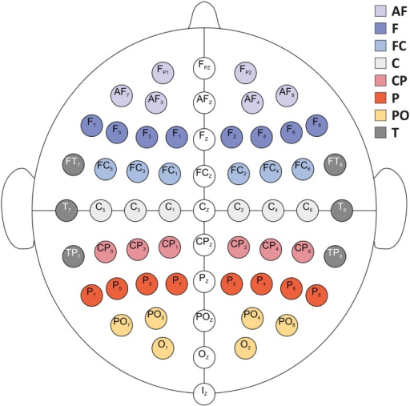

# The Basics on EEG

[MIT website](http://www.mit.edu/~gari/algos.html)
- Definitions

- EEG 10-20 system:

 

- Different EEG wave patterns ([frequency bands](https://en.wikipedia.org/wiki/Electroencephalography)):

Band | Frequncy (Hz) |
--- | --- | 
Delta | <4 | 
Theta | 4-7  | 
Alpha | 8-15  | 
Beta | 16-31 | 
Gamma | >32 | 
Mu | 8-12 | 

Note: Unfortunately there is no agreement in standard reference works on what these ranges should be...

# Channels on EEG
- [Sollfrank, 2015](https://www.ncbi.nlm.nih.gov/pubmed/?term=3D+visualization+of+movements+can+amplify+motor+cortex+activation+during+subsequent+motor+imagery):3D visualization of movements can amplify motor cortex activation during subsequent motor imagery

# EEG analysis tool
* [EEG toolbox--ERPLab](https://github.com/lucklab/erplab)
* [EEGLAB](https://sccn.ucsd.edu/eeglab/index.php)
  - [EEGLab 2018 Pittsburgh](https://sccn.ucsd.edu/wiki/EEGLAB_2018_Pittsburgh): by Drs. Scott Makeig and Arnaud Delorme
  - [Arnaud Delorme's webpage](http://arnauddelorme.com/): arnodelorme at gmail dot com
  - [Dynamic Brain Sources of Visual Evoked Responses](https://sccn.ucsd.edu/science2002.html)

# Others:
- **Questions from IRB:** 
1. Some references cite a risk of EEG-induced seizures.  Please clarify this and consider revising the statement that EEG and fNIRS “will not cause any harmful effects to the subjects.”
   - [What are the risks of an EEG?](https://www.hopkinsmedicine.org/healthlibrary/test_procedures/neurological/electroencephalogram_eeg_92,P07655)
   - [3 EEG Activation Procedures Used to Induce Seizures](http://www.rscdiagnosticservices.com/blog/three-eeg-activation-procedures-used-to-induce-seizures-in-eegs)
   
2. Since the study involves collecting physiological/clinical data, such as EEG and fNIRS, it is recommended that a qualified medical doctor be included on the research team. Since these data may be indicative of potential medical abnormalities, such as epilepsy, sleep disorder, brain tumor, stroke, and mental disorders, a trained medical doctor would be better prepared to deal with any contingencies.
 